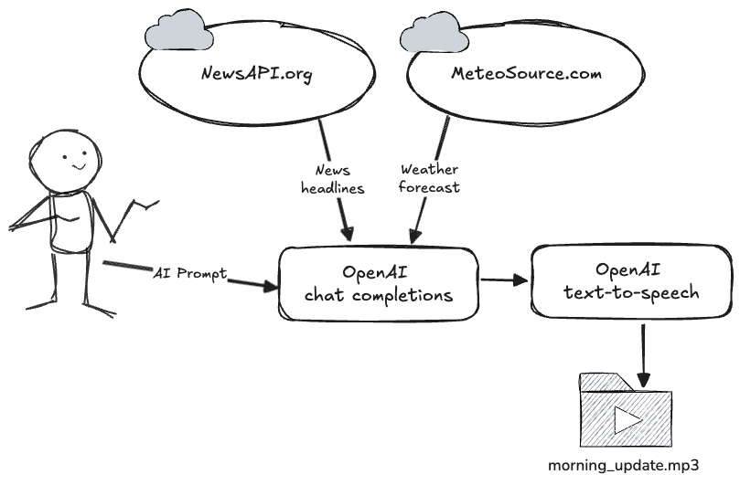

# Code-along: Generating a "Morning update" using APIs

In this code-along, we'll use Python to combine several APIs to generate an MP3 file with a "morning update" to enjoy each day with our coffee. Our goal is to create an personalized "daily update" message that includes today's weather forecast and the ten most significant news headlines.

We will gather all the necessary information for our message from NewsAPI and Meteosource, two free online services that offer API access. Then, we'll use a custom prompt with the **OpenAI chat completions API** to generate an engaging message. Finally, we will send this message to the **OpenAI text-to-speech API** to generate an audio file of the message being read aloud and save it to our workspace so we can download and listen to it.

## A quick refresher on API concepts

Before we get started let's refresh a few important API concepts. If you've already worked with APIs before, or if you completed my [Introduction to APIs in Python course](https://www.datacamp.com/courses/introduction-to-apis-in-python), none of this should be new. For those of you who have never worked with APIs before or have limited experience, this is a useful refresher and will make following along with the rest of the code-along a lot easier.

  
What is an API?
 
  

APIs, or Application Programming Interfaces, are like the messengers of the digital world, making sure apps, devices, and services can talk to each other smoothly. They let different systems share data and perform actions without getting tangled in each other’s code. You might not notice it, but APIs are behind almost everything we do digitally. Plug in your electric car, and an API’s handling the data exchange with the charger. Check the weather or get an email on your phone? That’s thanks to APIs pulling and delivering data from online sources to your device.

In essence, APIs make life easier for both developers and users, setting the rules for how apps communicate and what they can share. Whether it’s streaming music, ordering food, or tracking fitness, APIs keep it all connected. They’re one of the most powerful, behind-the-scenes technologies that make our digital world feel effortless, despite being complex and varied under the hood.
   

  
REST APIs
 
  

APIs come in many different styles and flavors, but for the purpose of this code-along, we will be focusing on REST APIs. REST APIs let two systems communicate over the internet, using HTTP, the same protocol your browser uses to load webpages. Think of it like typing a website address into your browser: you send a request, and the page loads in response. 

With rest APIs, the system that sends the request is called **the client**, the system the receives the request and returns a response is usually **the server**. 

   

  
HTTP Verbs
 
  

REST APIs are based on HTTP verbs. These describe the action the client wishes to perform on a resource on server. In total there are 9 HTTP verbs, in practice you'll be using the 4 most common verbs described in the table below.

| Verb   | Action |
|-|-|
| `GET`    | Reading a resource |
| `POST`   | Create a new resource |
| `PUT`    | Update an existing resource |
| `DELETE` | Delete a resource |
   

  
URLs and parameters
 
  

A REST API is accessible over the internet through a URL, which acts like an address that points to a specific resource on the server. This URL includes several parts, as shown in the image: the protocol (http://), the server’s domain (350.5th-ave.com), the port number (like :80), the path to the specific resource (e.g., /unit/243), and optional query parameters (e.g., ?floor=77).

When interacting with REST APIs, you’ll often need to include additional information, like filters or specific search terms, to get exactly the data you want. This extra information is usually passed as query parameters in the URL. These parameters help refine your request to retrieve more specific data, making the API flexible and responsive to a wide range of needs.
   

  
Headers
 
  

Headers carry additional information about the request or response, providing context for how the message should be processed. They can specify how the authenticate or what the content type is that's being sent. Headers essentially help the server and client understand the message’s format and how to handle it. Each header is a key-value pair, written as `Key: Value`, where the key is case-insensitive.
   

  
Response status codes
 
  

There are over 70 HTTP status codes, grouped into five main categories. These categories help us quickly understand the nature of the response. Codes starting with 1XX are informational, 2XX indicate success, 3XX handle redirections, 4XX signal client-side errors, and 5XX point to server-side issues.

Among these, three key codes to remember are:
- `200` **OK**: The request was successful, and the server returned the expected data.
- `404` **Not Found**: The server couldn’t find the requested resource.
- `500` **Internal Server Error**: Something went wrong on the server’s side, causing the request to fail.

   

# Overview

## Task 0: Preparing your workbook

Before we can get started talking to our APIs, we first need to configure our workbook so it has access to all the information it needs to talk to the APIs we plan to use. This involves setting up and loading environment variables in your DataLab workbook.

## Task 1: Fetching new headlines from NewsAPI
Once all set-up is done, we start by fetching the most recent news headlines from the newsapi.org API. Using API key authantication via URL parameters we can securely retrieve the latest headlines and store them in a variable for later use.

## Task 2: Fetching weather data from Meteosource
Now we can move on to using the meteosource API to get the weather forecast for our location. We'll first need to find the `place_id` for our location before we can fetch the forecast so we'll need to make 2 API requests here in order to get the job done. For meteosource.com we'll also use API-key authentication but this time we'll send the API key via the headers instead of URL parameters.

## Task 3: Using OpenAI completions API to generate the "morning update"
Once we have retrieved all information from the newapi.org and meteosource.com APIs, we can now use OpenAI completions API (which is the API version of ChatGPT) to generate a nice and engaging "morning update" message. The API we'll be using here uses the POST http verb so we'll need to adjust the `requests` functions we are using and also tweak the function arguments.

## Task 4: Generate an MP3 using OpenAI text-to-speech API
Finally, once we have generated a message, we can now use the text-to-speech API from OpenAI to generate an audio stream using our voice of preference. We'll save the stream locally to an .mp3 file which we can then download and play.
